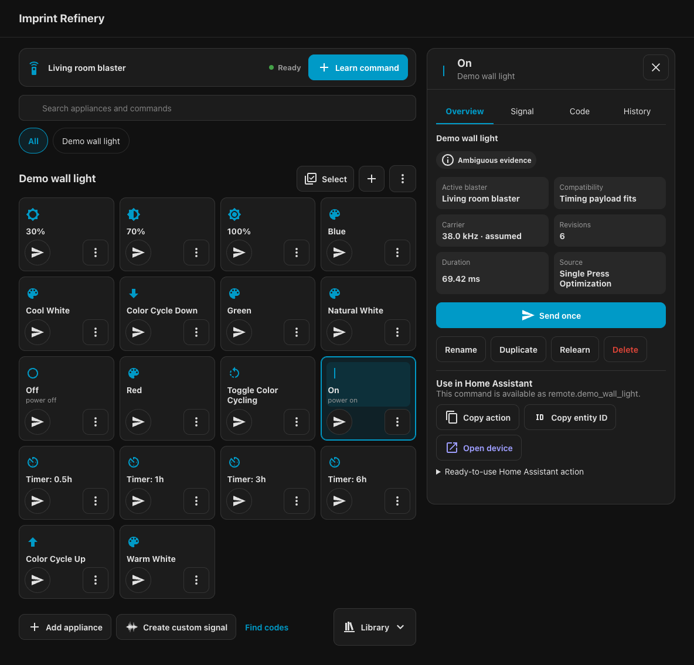
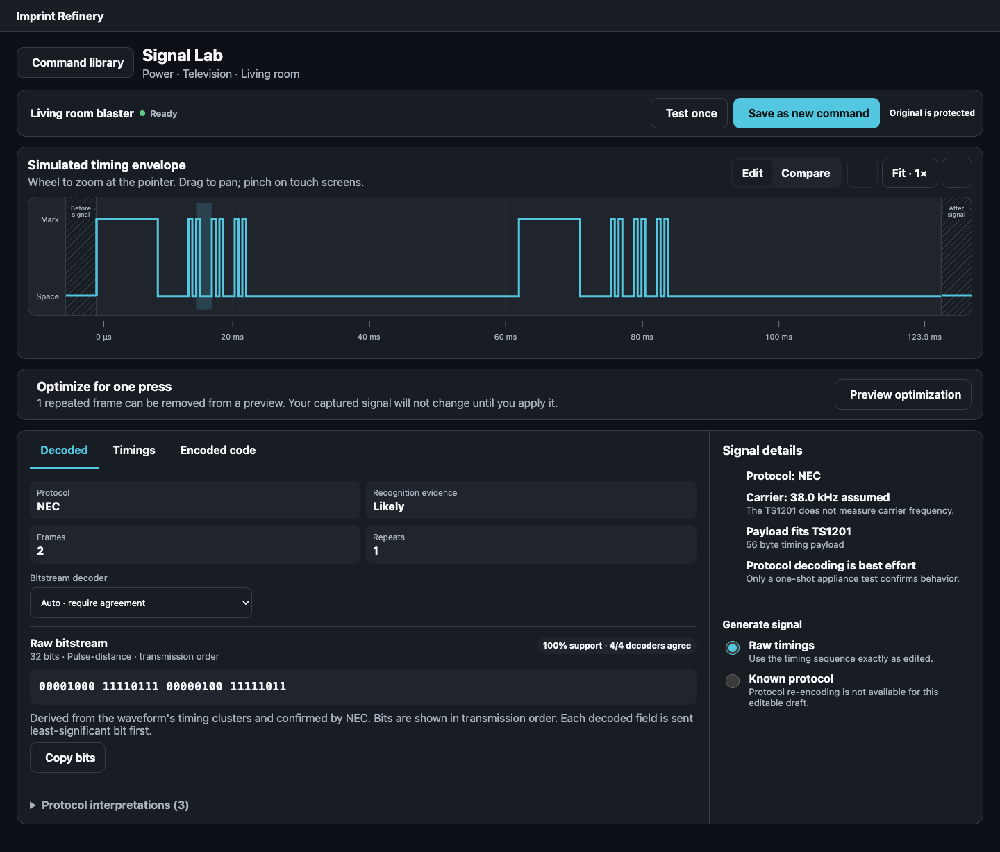
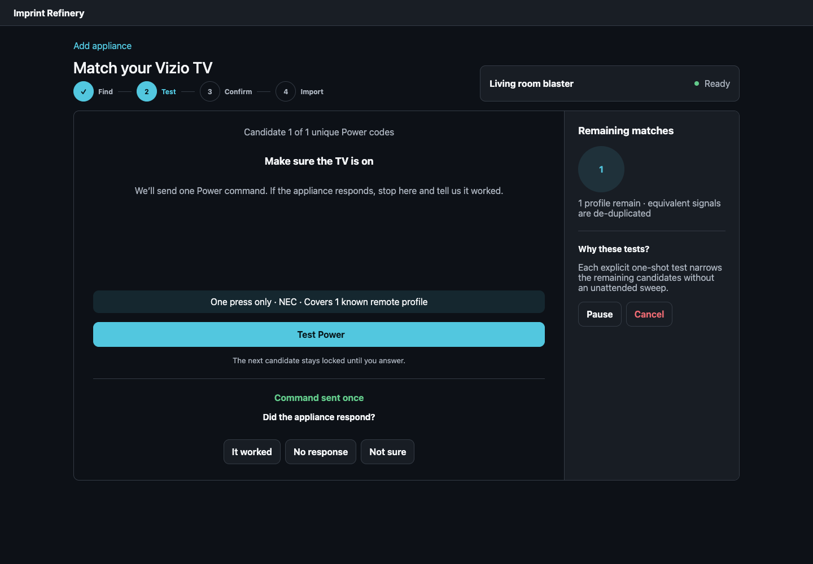

<p align="center">
  
</p>

<h1 align="center">Imprint Refinery</h1>

<p align="center">
  Learn, inspect, organize, and send infrared commands from Home Assistant.
</p>

<p align="center">
  <a href="https://github.com/emrikol/imprint-refinery/actions/workflows/validate.yml"></a>
  <a href="LICENSE"></a>
</p>

Imprint Refinery is a Home Assistant custom integration that stores learned
infrared commands locally and exposes them through native entities and actions.
Raw timing data remains available for inspection, editing, import, and export.

## Features

- Learn commands from a physical remote with a timed capture flow.
- Organize commands by appliance and optional location.
- Use saved commands through native `remote`, `media_player`, `switch`, and
  `button` entities.
- Inspect raw timings, decoded protocols, frame structure, and carrier data.
- Edit a protected copy of a signal in Signal Lab without overwriting the
  original.
- Import and export Imprint backups, Girr, Flipper IR, LIRC raw, Pronto Hex,
  raw timings, and Zosung Base64.
- Search the bundled Flipper-IRDB catalog without a cloud account.
- Keep an immutable revision history for captured, imported, and edited
  commands.

The integration does not require a vendor cloud account or a separate helper
entity.

## In Home Assistant

### Command library

Browse commands by appliance, send them directly, and copy ready-to-use Home
Assistant actions from the inspector.

[](docs/images/command-library.png)

### Signal Lab

Inspect the timing envelope, raw bitstream, decoder agreement, and protocol
evidence without changing the protected source signal. Smooth capture jitter
from measured averages, or preview a canonical rebuild for any recognized
protocol that supplies a complete encoder.

[](docs/images/signal-lab.png)

### Guided catalog matching

Search the bundled offline catalog, test likely matches, and import only the
commands that work.

[](docs/images/guided-matching.png)

## Requirements

- Home Assistant 2026.9.0 or newer
- A Home Assistant `infrared` emitter entity or a supported compatibility bridge
- Receiver capability on that hardware if you want to learn commands

## Supported hardware

Imprint Refinery discovers emitters and receivers exposed through Home
Assistant's `infrared` entity contract. Hardware using that contract does not
need an Imprint-specific driver.

The included compatibility driver supports a ZHA-connected Tuya TS1201 / MOES
UFO-R11 using the `zhaquirks.tuya.ts1201.ZosungIRBlaster` quirk.

## Installation

### HACS

[](https://my.home-assistant.io/redirect/hacs_repository/?owner=emrikol&repository=imprint-refinery&category=integration)

1. Add this repository to HACS as an **Integration**.
2. Install **Imprint Refinery**.
3. Restart Home Assistant.
4. Open **Settings** > **Devices & services** > **Add integration**, then select
   **Imprint Refinery**.

### Manual

Copy `custom_components/imprint_refinery` into your Home Assistant
`custom_components` directory, restart Home Assistant, and add the integration
from **Settings** > **Devices & services**.

See [Installation](docs/INSTALLATION.md) for setup, updates, the optional
dashboard card, and removal.

## Learn a command

1. Open **Imprint Refinery** from the Home Assistant sidebar.
2. Select **Learn command**.
3. Point the original remote at the IR receiver and press one button.
4. Review the captured signal, give it a name, and save it.
5. Use **Send once** to check the result on the appliance.

Infrared is one-way. A successful send means Home Assistant handed the signal
to the emitter; the appliance does not acknowledge it.

## Automations

In Home Assistant's automation editor, add a **Device** action, select the
Imprint appliance, and choose **Send a saved command**. The editor provides a
named command list plus compact **Repeats** and **Delay seconds** fields.

The resulting action is ordinary Home Assistant YAML:

```yaml
device_id: 11111111111141118111111111111111
domain: imprint_refinery
type: send_saved_command
entity_id: remote.wall_light
command_id: warm_white
num_repeats: 3
delay_secs: 0.4
```

`num_repeats` is the total number of transmissions; the delay applies only
between them. Each transmission sends the complete saved waveform, including
any frames the recognized protocol requires for one logical press. The command
Inspector can copy the ready-to-use action. See
[Home Assistant actions](docs/SERVICES.md).

## Optional dashboard card

The integration registers an optional dashboard card automatically. See
[Installation](docs/INSTALLATION.md#optional-dashboard-card) for the card
configuration and troubleshooting steps.

## Known limitations

- Infrared is one-way. A successful send confirms that the emitter accepted the
  signal, not that the appliance received it.
- Learning requires receiver hardware. Emit-only hardware can send imported or
  previously learned commands but cannot capture a physical remote.
- Some receivers do not report carrier frequency. TS1201 captures use an
  assumed 38 kHz carrier and label it as assumed throughout the interface.
- A single-button capture does not reveal indefinite hold behavior. Use explicit
  repeat and delay settings when an appliance needs repeated transmissions.

## Documentation

- [Installation](docs/INSTALLATION.md)
- [Home Assistant actions](docs/SERVICES.md)
- [Troubleshooting](docs/TROUBLESHOOTING.md)
- [Backup format](docs/BACKUP-FORMAT.md)
- [Protocol recognition](docs/PROTOCOL-RECOGNITION.md)
- [Offline catalog](docs/OFFLINE-CATALOG.md)
- [Architecture](docs/ARCHITECTURE.md)
- [Contributing](CONTRIBUTING.md)
- [Security](SECURITY.md)

## Development

```bash
python3 -m pip install -r requirements-dev.txt
npm ci --ignore-scripts
python3 -m ruff check .
python3 -m ruff format --check .
python3 tools/check_repository.py
npm run typecheck
python3 -m pytest -q
npm run build
npm run smoke:browser
```

See [Contributing](CONTRIBUTING.md) for the complete development setup and
project conventions.

## LLM disclosure

Development of Imprint Refinery relies on support from large language models.
Do not assume that all of its code or documentation has received human review.
This is disclosed so people who prefer not to use LLM-assisted projects can
make an informed choice.

The repository ships English text. Human-reviewed translations are welcome as
pull requests.

## Support and forks

Imprint Refinery is a personal open-source project. Anyone who uses it does so
at their own risk. I maintain it in my spare time because I use it myself. If I
stop using it, development may stop without notice. The project is provided
as-is, with no support commitment or promise of maintenance or bug fixes.
Filing an issue or pull request does not guarantee a reply, investigation, fix,
review, or merge. Reports and contributions may be closed at any time.

The source code is free software, and anyone may fork, modify, and redistribute
it under the terms of the license. The logo was generated by a generative image
model and is dedicated to the public domain under
[CC0 1.0 Universal](https://creativecommons.org/publicdomain/zero/1.0/); any
copyright or related rights that may exist are waived to the fullest extent
allowed by law. CC0 does not grant rights to the Imprint Refinery name or permit
modified distributions to present themselves as this project. Modified
distributions must use a different name and identity.

## Credits and license

Inspired by [slawa19's IR Learning Hub](https://github.com/slawa19/IR-Learning-Hub).

Imprint Refinery is licensed under
[`GPL-2.0-or-later`](LICENSE). Bundled data and frontend dependencies retain
their original licenses; see [Third-party notices](THIRD_PARTY_NOTICES.md).
